# Meggy
A 1MB Kickstart ROM for the A500+, using a 16 Mbit M29F160 parallel NOR flash, USB programmable from your PC

***

<a href="images/Meggy_revA_pic1.png">
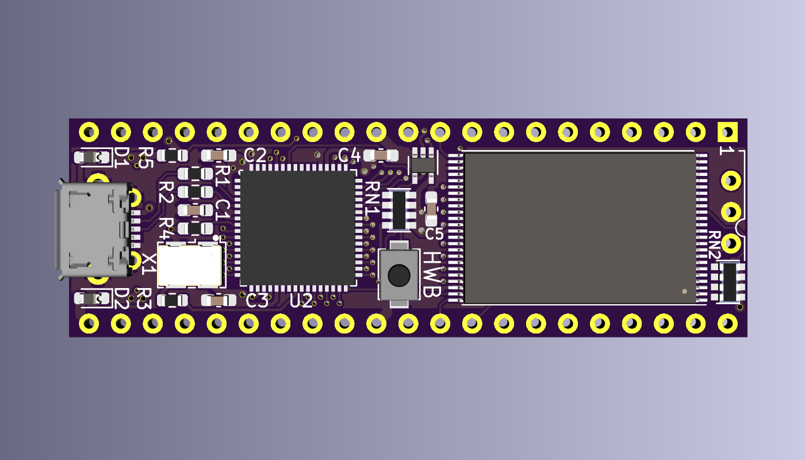
</a>
<br />
<a href="images/Meggy_revA_pic2.png">

</a>
<br />

***

# Bill of Materials — Meggy Rev B

| Ref | Qty | Value | Description | Package | Notes | Mouser |
|-----|-----|-------|-------------|---------|-------|--------|
| U1 | 2 | — | Pin strip 1×21, 2.54mm pitch, 0.4mm square pins | — | <span title="Cut from 1×50 1.27mm pitch strip, remove every other pin to give 2.54mm pitch. Fits Amiga dual-wipe socket better than standard 0.47mm turned pins.">Pin strip info...</span> | [AliExpress example](https://www.aliexpress.com/item/4000979931385.html) |
| U2 | 1 | AT90USB1286-MU | AVR USB microcontroller | QFN-64 | | [556-AT90USB1286-MU](https://www.mouser.com/ProductDetail/556-AT90USB1286-MU) |
| U3 | 1 | M29F160FT55N3E2 | 2MB NOR Flash (top-boot) | TSOP-48 | | [913-M29F160FT55N3E2](https://www.mouser.com/ProductDetail/913-M29F160FT55N3E2) |
| U4 | 1 | 74AHCT1G126GW | Single tristate buffer | SC-70-5 / SOT-353 | <span title="Isolates Gary's /OE signal from the flash chip during USB programming. 10k pull-up on EN keeps buffer enabled by default even with no firmware loaded.">OE isolation...</span> | [771-AHCT1G126GW125](https://www.mouser.com/ProductDetail/771-AHCT1G126GW125) |
| D1, D2 | 2 | CDBU0520 | Schottky diode 0.5A 20V | SOD-523F / 0603 | <span title="Diode-OR between VBUS (USB 5V) and VCC (Amiga 5V). Prevents backfeed between the two supplies. Higher voltage wins.">Power OR...</span> | [750-CDBU0520](https://www.mouser.com/ProductDetail/750-CDBU0520) |
| X1 | 1 | 16 MHz | Crystal oscillator SG5032CCN 16.000000M-HJGA3 | 5×3.2mm SMD | | [732-5032CC16.0HJGA3](https://www.mouser.com/ProductDetail/732-5032CC16.0HJGA3) |
| SW1 | 1 | — | Sunrom Tactile Switch SMD | 3×4×2mm | <span title="Hold SW1 (HWB) and run --avr-reset, or hold SW1 and power cycle, to enter DFU bootloader mode for firmware programming.">HWB / DFU entry...</span> | [AliExpress example](https://www.aliexpress.com/item/32855171871.html) |
| J1 | 1 | 10118194-0001LF | Micro USB-B connector, Amphenol FCI, 5-pin | SMD | | [649-10118194-0001LF](https://www.mouser.com/ProductDetail/649-10118194-0001LF) |
| J2 | 1 | MSK12D19 | SMD slide switch, 3-pin, 2.5mm pitch | SMD | <span title="Flash A19 select — open = slot 1 (pull-up), shorted to GND = slot 0. Pins bent to right angle for flush mounting. Alternatively a 3-pin 2.54mm right-angle pin header with external toggle switch.">Flash A19 slot select...</span> | [AliExpress example](https://www.aliexpress.com/item/1005006482584650.html) |
| RN1, RN2 | 2 | 10k | Resistor network 4×10kΩ isolated | 0603×4 (1206) | CAY16-103J4LF | [652-CAY16-103J4LF](https://www.mouser.com/ProductDetail/652-CAY16-103J4LF) |
| R1, R2 | 2 | 22Ω | CR0603-FX-22R0ELF — USB D+/D− series resistors | 0603 | | [652-CR0603FX-22R0ELF](https://www.mouser.com/ProductDetail/652-CR0603FX-22R0ELF) |
| R3 | 1 | 22Ω | CR0603-FX-22R0ELF — Clock series termination | 0603 | | [652-CR0603FX-22R0ELF](https://www.mouser.com/ProductDetail/652-CR0603FX-22R0ELF) |
| R4 | 1 | 100Ω | CR0603-FX-1000ELF — VBUS detection | 0603 | <span title="Series resistor between VBUS_5V and AVR VBUS pin 8 for USB bus voltage detection.">VBUS detect...</span> | [652-CR0603FX-1000ELF](https://www.mouser.com/ProductDetail/652-CR0603FX-1000ELF) |
| R5 | 1 | 10kΩ | CR0603-FX-1002ELF — OE_BUF_EN pull-up | 0603 | <span title="Pull-up to VCC on PE4 (OE_BUF_EN). Keeps the 74AHCT1G126GW buffer enabled by default so Gary controls /OE even with no firmware loaded.">OE_BUF_EN pull-up...</span> | [652-CR0603FX-1002ELF](https://www.mouser.com/ProductDetail/652-CR0603FX-1002ELF) |
| C1 | 1 | 1µF | CL10B105KA8NNND | 0603 | <span title="UCAP filter capacitor on AVR pin 7. Required for the AT90USB1286 internal USB voltage regulator.">UCAP filter...</span> | [187-CL10B105KA8NNND](https://www.mouser.com/ProductDetail/187-CL10B105KA8NNND) |
| C2, C3, C4, C5 | 4 | 100nF | CL10B104KA8NNNC — Bypass decoupling | 0603 | <span title="Bypass decoupling capacitors. Place as close as possible to the VCC pins of U2, U3 and U4.">Bypass decoupling...</span> | [187-CL10B104KA8NNNC](https://www.mouser.com/ProductDetail/187-CL10B104KA8NNNC) |

## Key ICs

**AT90USB1286-MU** — Atmel/Microchip AVR, 128KB flash, native full-speed USB, QFN-64. Runs the Meggy firmware and provides USB bulk transfer for flash programming. DFU bootloader in hardware boot section (no external programmer needed after initial setup).

**M29F160FT55N3E2** — Micron/ST 16Mbit (2MB) NOR flash, top-boot, 55ns, 5V, x16. Stores two 1MB Kickstart image slots selectable via the A19 switch. [Datasheet](https://www.mouser.com/datasheet/3/893/1/M29FxxFT_FB.pdf)

**74AHCT1G126GW** — Single buffer with tristate output (active-high enable). Isolates Gary's /OE signal from the flash chip during USB programming operations. 10k pull-up on EN ensures the buffer is enabled (Amiga in control) by default even with no firmware loaded.

**CDBU0520** — Comchip 0.5A 20V Schottky diode, SOD-523F (0603 footprint). Two used for power OR between VBUS (USB) and VCC (Amiga). Prevents backfeed between the two supplies.

## Power

The board can be powered from either:
- **VBUS** (USB 5V) — when connected to a PC for programming
- **VCC** (Amiga 5V) — when installed in the Amiga

D1 and D2 form a diode-OR, allowing both supplies to coexist safely. The higher voltage wins. Schottky forward drop is approximately 150–200mV at typical operating currents.

***

# Assembly Notes

## Pin Headers (U1)

The two 1×21 pin headers that plug into the Amiga ROM socket are cut from a standard **1×50 1.27 mm pitch strip**. Every other pin is removed, leaving 21 pins per row at 2.54 mm pitch.

The reason for starting with a 1.27 mm strip rather than a conventional 2.54 mm strip is pin geometry: the 1.27 mm strip has **0.4 mm square pins**, which seat noticeably better in Amiga dual-wipe sockets than the standard turned (round) pins found on 2.54 mm strips. Turned pins are typically ~0.47 mm in diameter and can spread the socket contacts over time, whereas the slimmer square pins make clean contact without stressing the socket.

**Steps:**
1. Take a 1×50 pin strip with 1.27 mm pitch (square pins, 0.4 mm across).
2. Count off 41 pins and snap or cut to length.
3. Starting from pin 2, pull out every other pin with pliers, leaving pins 1, 3, 5 … 41 — 21 pins total at 2.54 mm pitch.
4. Repeat for the second row.
5. Insert the strips through the PCB from the bottom (component side) and solder from the top.

***

# Windows Setup

Meggy uses two distinct USB personalities:

| Mode | USB ID | When active | Driver needed |
|------|--------|-------------|---------------|
| **DFU bootloader** | 03EB:2FFB | Hold SW1 during power-up | libusb-win32 (via Zadig) |
| **Flash programmer** | 03EB:2044 | Normal firmware operation | WinUSB (via Zadig) |

Both drivers are installed with [Zadig](https://zadig.akeo.ie). The steps below cover the full setup from a fresh Windows machine.

---

## Step 1 — Install Python

Download Python 3.x (64-bit) from [python.org](https://www.python.org/downloads/) and run the installer.

**Important:** tick **"Add python.exe to PATH"** before clicking Install Now.

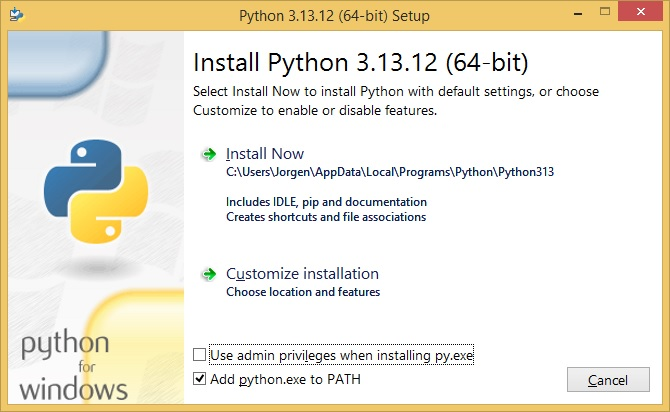

---

## Step 2 — Install PyUSB

Open a Command Prompt and run:

```
pip install pyusb
```

If you run `meggy_flash.py` before installing PyUSB you will see the reminder message shown below — just run the pip command and try again.

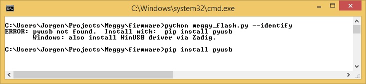

---

## Step 3 — Install libusb-1.0.dll

PyUSB on Windows requires `libusb-1.0.dll` to be present. Download the latest libusb release from [libusb.info](https://libusb.info), open the archive with 7-Zip or similar, and copy `libusb-1.0.dll` from the `VS2015\MS64\dll\` folder into `C:\Windows\System32`.

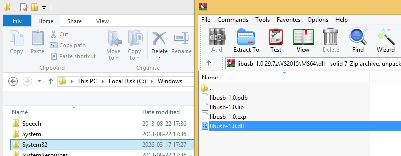

---

## Step 4 — Install Zadig

Download [Zadig](https://zadig.akeo.ie) (a single portable `.exe`, no installation required) and save it somewhere convenient.

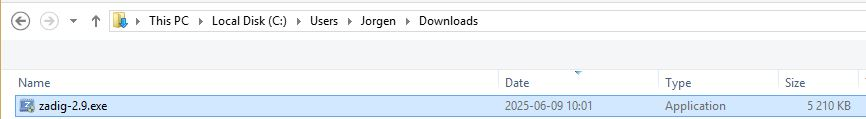

---

## Step 5 — Install the DFU driver (libusb-win32)

This driver is used when Meggy is in DFU bootloader mode for **firmware** programming.

**Put Meggy into DFU mode:**
1. Hold **SW1** (HWB button on the board).
2. Plug in the USB cable (or disconnect USB and Amiga power, then reconnect).
3. Release **SW1**.

Windows will detect a new device. Without the driver it appears as **AT90USB128 DFU** under *Other devices* in Device Manager with a warning icon.

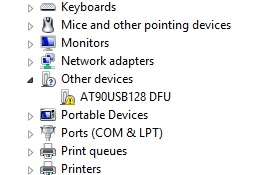

Open Zadig. The device **AT90USB128 DFU** (USB ID `03EB 2FFB`) should appear in the dropdown. Make sure the target driver on the right is set to **libusb-win32**, then click **Install Driver**.


Zadig installs the driver (this takes a few seconds).

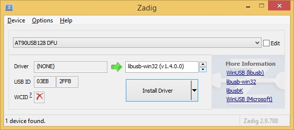

When complete, Zadig reports **"The driver was installed successfully."**

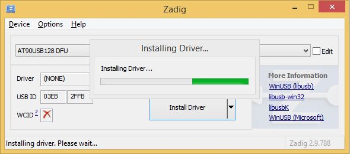

Device Manager now shows **AT90USB128 DFU** under *libusb-win32 devices* — no warning icon.

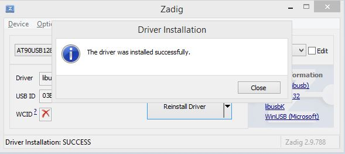

---

## Step 6 — Install the Flash Programmer driver (WinUSB)

This driver is used during normal operation when Meggy presents itself as the **Meggy Flash Programmer** for **NOR flash** programming.

Unplug Meggy and plug it back in without holding SW1 so it boots into normal firmware mode. Windows detects it as **Meggy Flash Programmer** under *Other devices*. If you try to install the driver via Windows Update or Device Manager directly, Windows will refuse because the INF lacks a digital signature.

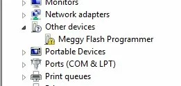
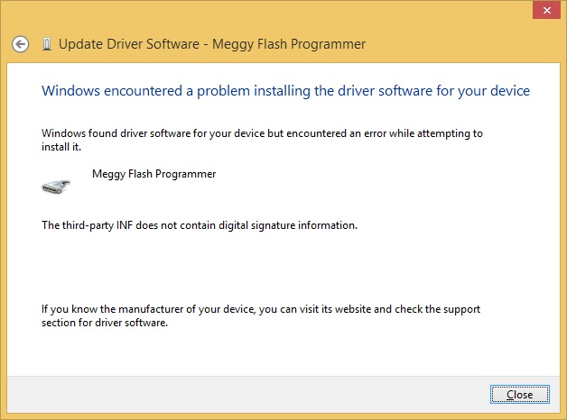

Use Zadig instead. Select **Meggy Flash Programmer** (USB ID `03EB 2044`) from the dropdown and confirm the target driver on the right is **WinUSB**, then click **Install Driver**.

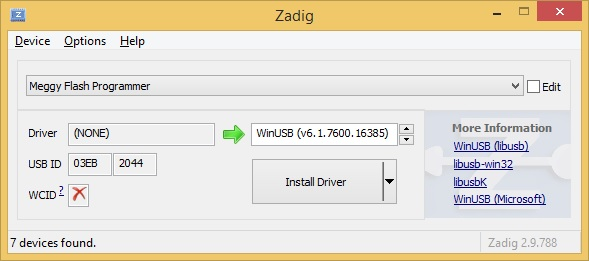

Zadig installs the driver and reports success.

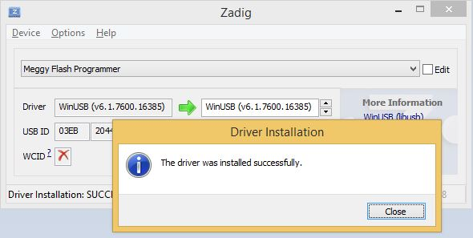

Device Manager now shows **Meggy Flash Programmer** under *Universal Serial Bus devices*.

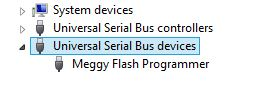

Both drivers are now in place and setup is complete.

***

# Firmware Programming

The AT90USB1286 ships with a USB DFU bootloader burned into the hardware boot section. This bootloader cannot be erased, so no external programmer is ever required after the chip is soldered.

## Entering DFU Mode

**Preferred method** (firmware already running, Rev C and Rev B with PE5→RESET bridge):
1. Hold **SW1** (HWB).
2. Run `python meggy_flash.py --avr-reset`
3. Release **SW1** once avrdude connects.

**Alternative method** (first time, or if firmware is not running):
1. Hold **SW1** (HWB).
2. Disconnect USB and Amiga power, then reconnect USB.
3. Release **SW1**.

The board will enumerate as **AT90USB128 DFU** (USB ID `03EB:2FFB`).

## Flashing the Firmware (Windows)

From the `firmware/` folder, run:

```bat
flash.bat
```

This calls `avrdude` with the `flip1` programmer protocol targeting the AT90USB1286 DFU bootloader and handles firmware upload and verification automatically. Some harmless warnings about fuse bits not being accessible via FLIP are expected and can be ignored.

After flashing, power cycle the board to return to normal firmware mode:
- **Standalone:** unplug and replug USB.
- **Installed in Amiga:** disconnect USB and Amiga power, then reconnect.

## Flashing the Firmware (Linux / macOS)

Install `dfu-programmer` via your package manager, then:

```sh
dfu-programmer at90usb1286 erase
dfu-programmer at90usb1286 flash meggy_firmware.hex
dfu-programmer at90usb1286 start
```

After flashing, power cycle the board. Meggy will enumerate as **Meggy Flash Programmer** (USB ID `03EB:2044`), ready for NOR flash programming.

***

# NOR Flash Programming

With the firmware running and the WinUSB driver installed, use `meggy_flash.py` from the `firmware/` folder to read and write the M29F160 NOR flash over USB.

**Important:** set the J2 switch to the desired slot **before** running any programming commands. The physical switch position determines which 1MB half of the flash chip is accessed — the software always programs whichever slot the switch currently selects.

## Quick-start

```sh
# Identify the device and flash chip
python meggy_flash.py --identify

# Write a Kickstart image (set J2 switch to desired slot first)
python meggy_flash.py --write kick31.rom

# Write a Kickstart image with 16-bit byte-swap applied (for unswapped ROM files)
python meggy_flash.py --write --swap kick31.rom

# Read back the current slot for verification
python meggy_flash.py --read-slot readback.bin

# Verify flash contents against a ROM file
python meggy_flash.py --verify kick31.rom

# Erase the current slot
python meggy_flash.py --erase

# Reset the AVR into DFU mode (press down and hold HWB button while executing command below)
python meggy_flash.py --avr-reset
```

***

# Image Slot Selection (J2)

J2 controls flash address line A19, selecting which of the two 1MB Kickstart image slots is visible to the Amiga at boot. The switch position also determines which slot is programmed when using `meggy_flash.py`.

| J2 position | Flash A19 | Slot | Typical use |
|-------------|-----------|------|-------------|
| Open | High (10k pull-up) | Slot 1 | Second image |
| Shorted to GND | Low | Slot 0 | Primary / default image |

The switch can be either the MSK12D19 SMD slide switch specified in the BOM (pins bent to right-angle for flush mounting) or a 3-pin 2.54 mm right-angle pin header fitted with an external toggle or jumper.

To change Kickstart without opening the Amiga, route a short cable from J2 to a switch mounted in a convenient location on the machine.
