# Meggy
A 1MB USB-programmable Kickstart ROM board for Amiga computers with a 42-pin ROM socket (A500+, A600). With a small modification also works in machines with a 40-pin ROM socket such as the A500 rev 6A and B2000.

***

<a href="images/Meggy_revC_pic1.png">

</a>
<br />
<a href="images/Meggy_revC_pic2.png">
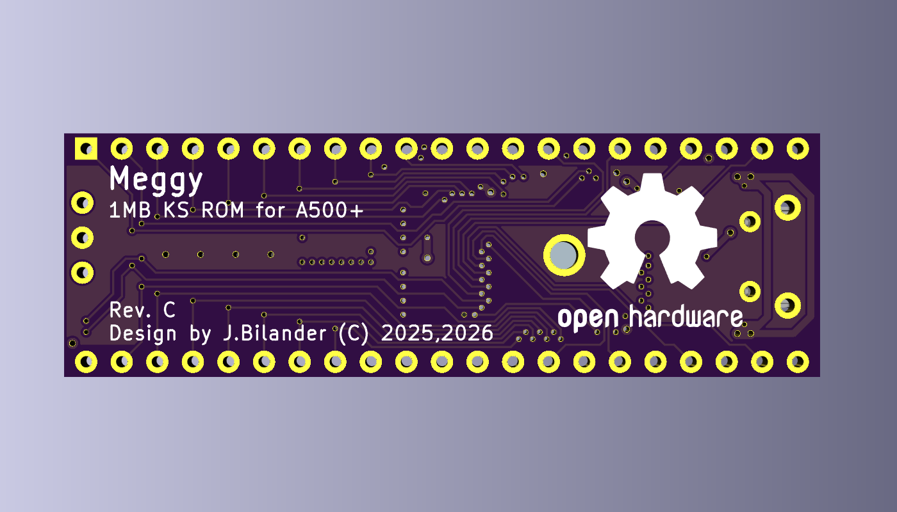
</a>
<br />
<a href="images/Meggy_revC_pic3.jpg">
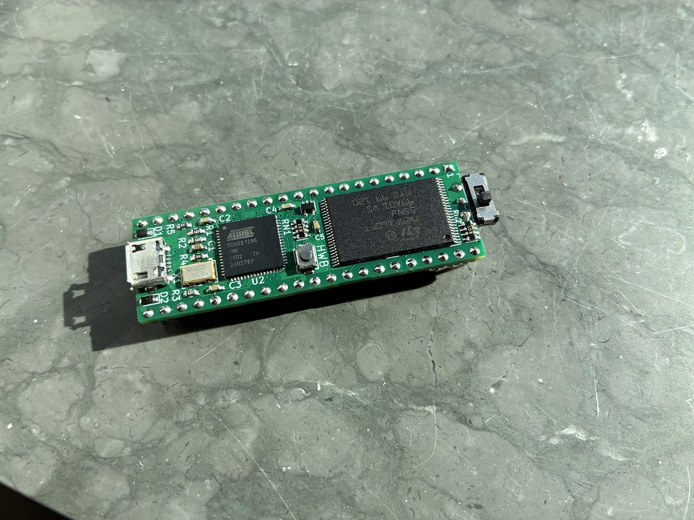
</a>
<br />
<a href="images/Meggy_revC_pic4.jpg">
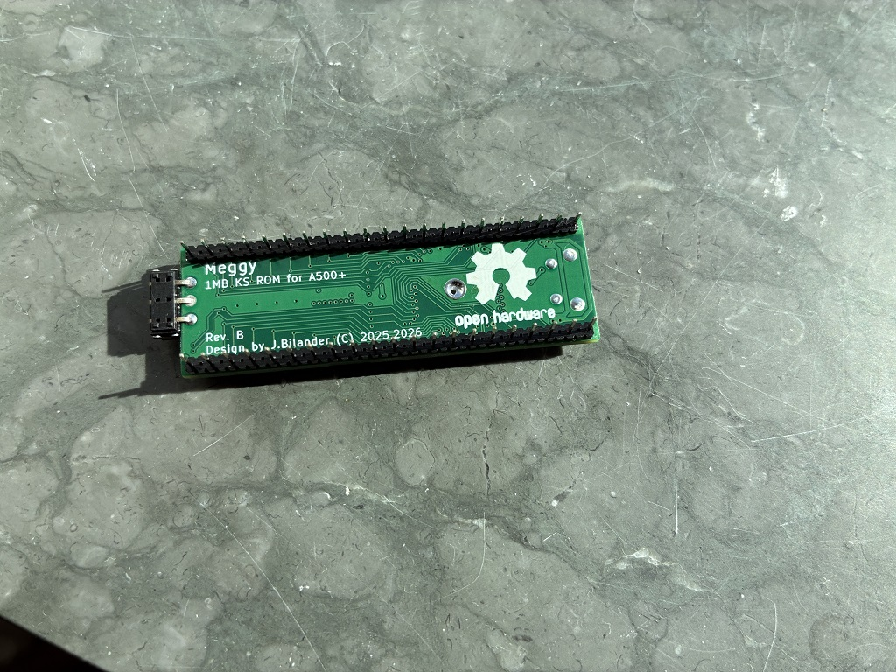
</a>
<br />
<a href="images/Meggy_revC_installed_in_A500_plus.jpg">
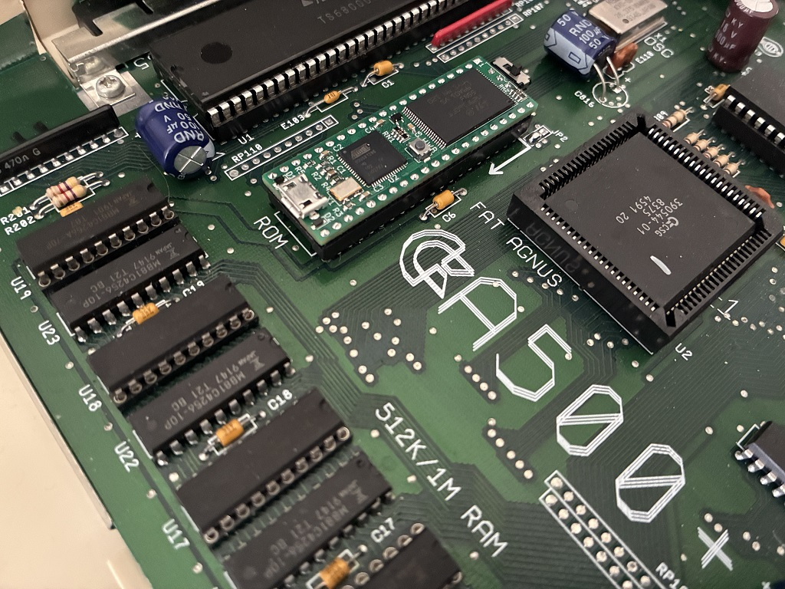
</a>
<br />

***

# Bill of Materials — Meggy Rev C

| Ref | Qty | Value | Description | Package | Notes | Mouser |
|-----|-----|-------|-------------|---------|-------|--------|
| U1 | 2 | — | Pin strip 1×21, 2.54mm pitch, 0.4mm square pins | — | <span title="Cut from 1×50 1.27mm pitch strip, remove every other pin to give 2.54mm pitch. Fits Amiga dual-wipe socket better than standard 0.47mm turned pins.">Pin strip info...</span> | [AliExpress example](https://www.aliexpress.com/item/4000979931385.html) |
| U2 | 1 | AT90USB1286-MU | AVR USB microcontroller | QFN-64 | | [556-AT90USB1286-MU](https://www.mouser.com/ProductDetail/556-AT90USB1286-MU) |
| U3 | 1 | M29F160FT55N3E2 | 2MB NOR Flash (top-boot) | TSOP-48 | | [913-M29F160FT55N3E2](https://www.mouser.com/ProductDetail/913-M29F160FT55N3E2) |
| U4 | 1 | 74AHCT1G126GW | Single tristate buffer | SC-70-5 / SOT-353 | <span title="Isolates Gary's /OE signal from the flash chip during USB programming. 10k pull-up on EN keeps buffer enabled by default even with no firmware loaded.">OE isolation...</span> | [771-AHCT1G126GW125](https://www.mouser.com/ProductDetail/771-AHCT1G126GW125) |
| D1, D2 | 2 | CDBU0520 | Schottky diode 0.5A 20V | SOD-523F / 0603 | <span title="Diode-OR between VBUS (USB 5V) and VCC (Amiga 5V). Prevents backfeed between the two supplies. Higher voltage wins.">Power OR...</span> | [750-CDBU0520](https://www.mouser.com/ProductDetail/750-CDBU0520) |
| X1 | 1 | 16 MHz | Crystal oscillator SG5032CCN 16.000000M-HJGA3 | 5×3.2mm SMD | | [732-5032CC16.0HJGA3](https://www.mouser.com/ProductDetail/732-5032CC16.0HJGA3) |
| SW1 | 1 | — | Sunrom Tactile Switch SMD | 3×4×2mm | <span title="Hold HWB button and run --avr-reset to enter DFU bootloader mode for firmware programming.">HWB / DFU entry...</span> | [AliExpress example](https://www.aliexpress.com/item/32855171871.html) |
| J1 | 1 | 10118194-0001LF | Micro USB-B connector, Amphenol FCI, 5-pin | SMD | | [649-10118194-0001LF](https://www.mouser.com/ProductDetail/649-10118194-0001LF) |
| J2 | 1 | MSK12D19 SMD | SMD slide switch, 3-pin, 2.5mm pitch | SMD | <span title="Flash A19 select — open = slot 1 (pull-up), shorted to GND = slot 0. Pins bent to right angle for flush mounting. Alternatively a 3-pin 2.54mm right-angle pin header with external toggle switch.">Flash A19 slot select...</span> | [AliExpress example](https://www.aliexpress.com/item/1005006482584650.html) |
| RN1, RN2 | 2 | 10k | Resistor network 4×10kΩ isolated | 0603×4 (1206) | CAY16-103J4LF | [652-CAY16-103J4LF](https://www.mouser.com/ProductDetail/652-CAY16-103J4LF) |
| R1, R2 | 2 | 22Ω | CR0603-FX-22R0ELF — USB D+/D− series resistors | 0603 | | [652-CR0603FX-22R0ELF](https://www.mouser.com/ProductDetail/652-CR0603FX-22R0ELF) |
| R3 | 1 | 22Ω | CR0603-FX-22R0ELF — Clock series termination | 0603 | | [652-CR0603FX-22R0ELF](https://www.mouser.com/ProductDetail/652-CR0603FX-22R0ELF) |
| R4 | 1 | 100Ω | CR0603-FX-1000ELF — VBUS detection | 0603 | <span title="Series resistor between VBUS_5V and AVR VBUS pin 8 for USB bus voltage detection.">VBUS detect...</span> | [652-CR0603FX-1000ELF](https://www.mouser.com/ProductDetail/652-CR0603FX-1000ELF) |
| R5 | 1 | 10kΩ | CR0603-FX-1002ELF — OE_BUF_EN pull-up | 0603 | <span title="Pull-up to VCC on PE4 (OE_BUF_EN). Keeps the 74AHCT1G126GW buffer enabled by default so Gary controls /OE even with no firmware loaded.">OE_BUF_EN pull-up...</span> | [652-CR0603FX-1002ELF](https://www.mouser.com/ProductDetail/652-CR0603FX-1002ELF) |
| C1 | 1 | 1µF | CL10B105KA8NNND | 0603 | <span title="UCAP filter capacitor on AVR pin 7. Required for the AT90USB1286 internal USB voltage regulator.">UCAP filter...</span> | [187-CL10B105KA8NNND](https://www.mouser.com/ProductDetail/187-CL10B105KA8NNND) |
| C2, C3, C4, C5 | 4 | 100nF | CL10B104KA8NNNC — Bypass decoupling | 0603 | <span title="Bypass decoupling capacitors. Place as close as possible to the VCC pins of U2, U3 and U4.">Bypass decoupling...</span> | [187-CL10B104KA8NNNC](https://www.mouser.com/ProductDetail/187-CL10B104KA8NNNC) |

## Key ICs

**AT90USB1286-MU** — Atmel/Microchip AVR, 128KB flash, native full-speed USB, QFN-64. Runs the Meggy firmware and provides USB bulk transfer for flash programming. DFU bootloader in hardware boot section (no external programmer needed after initial setup).

**M29F160FT55N3E2** — Micron/ST 16Mbit (2MB) NOR flash, top-boot, 55ns, 5V, x16. Stores two 1MB Kickstart image slots selectable via the A19 switch. [Datasheet](https://www.mouser.com/datasheet/3/893/1/M29FxxFT_FB.pdf)

**74AHCT1G126GW** — Single buffer with tristate output (active-high enable). Isolates Gary's /OE signal from the flash chip during USB programming operations. 10k pull-up on EN ensures the buffer is enabled (Amiga in control) by default even with no firmware loaded.

**CDBU0520** — Comchip 0.5A 20V Schottky diode, SOD-523F (0603 footprint). Two used for power OR between VBUS (USB) and VCC (Amiga). Prevents backfeed between the two supplies.

## Power

The board can be powered from either:
- **VBUS** (USB 5V) — when connected to a PC for programming
- **VCC** (Amiga 5V) — when installed in the Amiga

D1 and D2 form a diode-OR, allowing both supplies to coexist safely. The higher voltage wins. Schottky forward drop is approximately 150–200mV at typical operating currents.

***

# Assembly Notes

## Pin Headers (U1)

The two 1×21 pin headers that plug into the Amiga ROM socket are cut from a standard **1×50 1.27 mm pitch strip**. Every other pin is removed, leaving 21 pins per row at 2.54 mm pitch.

The reason for starting with a 1.27 mm strip rather than a conventional 2.54 mm strip is pin geometry: the 1.27 mm strip has **0.4 mm square pins**, which seat noticeably better in Amiga dual-wipe sockets than the standard turned (round) pins found on 2.54 mm strips. Turned pins are typically ~0.47 mm in diameter and can spread the socket contacts over time, whereas the slimmer square pins make clean contact without stressing the socket.

**Steps:**
1. Take a 1×50 pin strip with 1.27 mm pitch (square pins, 0.4 mm across).
2. Count off 41 pins and snap or cut to length.
3. Starting from pin 2, pull out every other pin with pliers, leaving pins 1, 3, 5 ... 41 — 21 pins total at 2.54 mm pitch.
4. Repeat for the second row.
5. Insert the strips through the PCB from the bottom (component side) and solder from the top.

**Tip — plastic guard orientation:** Consider inserting the pin strips with the plastic guard facing away from the PCB (towards the pin tips) rather than flush against the board. If you ever need to remove the guards later — for example when fitting Meggy into a single-wipe socket where the extra height prevents the board from seating fully — they can simply be slid off by hand. If the guard is trapped against the PCB you have to pry it away with a blade first, which is fiddly and risks damage. The trade-off is that you need to hold each strip at the correct insertion depth while tacking it in place, since the guard can no longer rest against the PCB as a natural stop.

## J2 Slide Switch (MSK12D19) — Bending and Soldering

The MSK12D19 is an SMD slide switch soldered flat on the PCB with its pins bent over and soldered from the top side. To change the Kickstart slot the Amiga needs to be opened. Alternatively J2 can be fitted with a 3-pin 2.54mm right-angle pin header and wired to an external toggle switch mounted somewhere accessible on the Amiga case.

<a href="images/Meggy_revC_bend_switch_and_solder_pic1.jpg">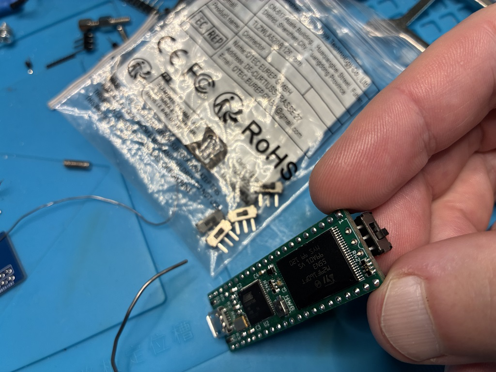</a>
<a href="images/Meggy_revC_bend_switch_and_solder_pic2.jpg">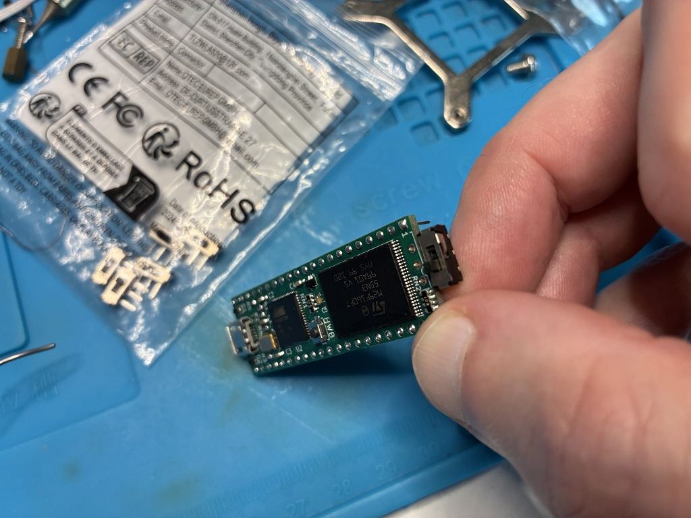</a>

**Steps:**
1. Place the switch into the J2 footprint so the three pins protrude slightly through the top side of the PCB.
2. With your fingers, bend all three pins over flat against the top surface so the switch body ends up level with the board.
3. Apply flux and solder the three pins from the top side with a regular soldering iron.

## AVR Exposed Pad and USB Connector — Soldering Technique

The AT90USB1286-MU QFN-64 has a large exposed thermal pad on the underside that must be soldered to the GND pour for reliable operation. The Micro USB connector also has through-hole anchor pins. Both benefit from using a desoldering station with good thermal mass — a ZD915 or similar works well for this.

<a href="images/Meggy_revC_exposed_pad_soldering_pic1.jpg">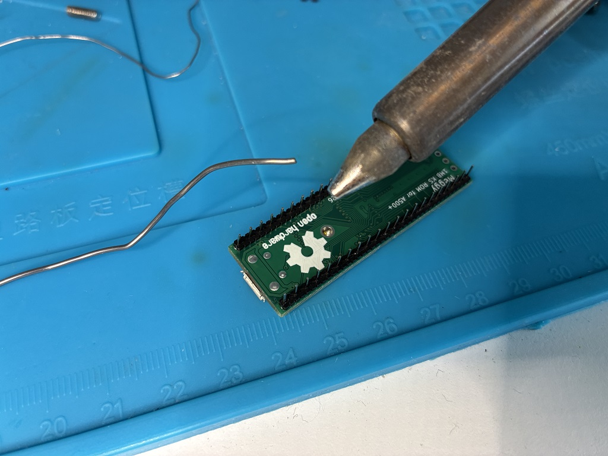</a>
<a href="images/Meggy_revC_exposed_pad_soldering_pic2.jpg">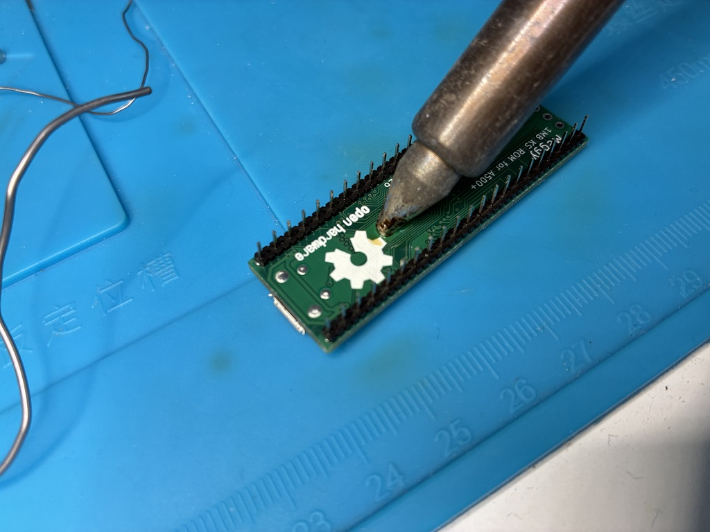</a>

**AVR exposed pad:**
1. Apply flux into the PCB via hole that sits directly under the exposed pad.
2. Place the desoldering nozzle against the hole from the underside and feed solder wire into the nozzle, holding for 3–4 seconds. The thermal mass of the station heats the via quickly and the solder wicks up through the hole making solid contact with the exposed pad above.

**USB connector through-hole anchor pins:**
1. Apply flux on both sides of the PCB at each anchor pin hole.
2. Solder from one side — applying flux to the opposite side encourages a clean bleed-through joint, giving a solid mechanical connection.

***

# Windows Setup

Meggy uses two distinct USB personalities:

| Mode | USB ID | When active | Driver needed |
|------|--------|-------------|---------------|
| **DFU bootloader** | 03EB:2FFB | No firmware, or HWB held during power-up | libusb-win32 (via Zadig) |
| **Flash programmer** | 03EB:2044 | Normal firmware operation | WinUSB (via Zadig) |

Both drivers are installed with [Zadig](https://zadig.akeo.ie). The steps below cover the full setup from a fresh Windows machine.

## Prerequisites

- **Arduino IDE 1.8.x** — provides `avrdude.exe` used by `flash.bat` to program the AVR firmware. Tested with Arduino IDE 1.8.16. Newer versions of Arduino IDE (2.x) install avrdude in a different location and may require editing the `AVR_PATH` variable in `build.bat` and `flash.bat`. Download from [arduino.cc](https://www.arduino.cc/en/software).
- **Python 3.x** — required for `meggy_flash.py` (see Step 1 below).

---

## Step 1 — Install Python

Download Python 3.x (64-bit) from [python.org](https://www.python.org/downloads/) and run the installer.

**Important:** tick **"Add python.exe to PATH"** before clicking Install Now.


---

## Step 2 — Install PyUSB

Open a Command Prompt and run:

```
pip install pyusb
```

If you run `meggy_flash.py` before installing PyUSB you will see the reminder message shown below — just run the pip command and try again.


---

## Step 3 — Install libusb-1.0.dll

PyUSB on Windows requires `libusb-1.0.dll` to be present. Download the latest libusb release from [libusb.info](https://libusb.info), open the archive with 7-Zip or similar, and copy `libusb-1.0.dll` from the `VS2015\MS64\dll\` folder into `C:\Windows\System32`.


---

## Step 4 — Install Zadig

Download [Zadig](https://zadig.akeo.ie) (a single portable `.exe`, no installation required) and save it somewhere convenient.


---

## Step 5 — Install the DFU driver (libusb-win32)

This driver is used when Meggy is in DFU bootloader mode for **firmware** programming.

**Put Meggy into DFU mode:**

A freshly soldered board with no firmware loaded will enter DFU mode automatically on power-up — just plug in the USB cable and the device enumerates as **AT90USB128 DFU** without any button press needed.

If firmware is already installed, hold the HWB button and run `python meggy_flash.py --avr-reset` (see the Firmware Programming section below).

Windows will detect a new device. Without the driver it appears as **AT90USB128 DFU** under *Other devices* in Device Manager with a warning icon.


Open Zadig. The device **AT90USB128 DFU** (USB ID `03EB 2FFB`) should appear in the dropdown. Make sure the target driver on the right is set to **libusb-win32**, then click **Install Driver**.


Zadig installs the driver (this takes a few seconds).


When complete, Zadig reports **"The driver was installed successfully."**


Device Manager now shows **AT90USB128 DFU** under *libusb-win32 devices* — no warning icon.

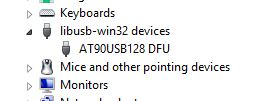

---

## Step 6 — Install the Flash Programmer driver (WinUSB)

This driver is used during normal operation when Meggy presents itself as the **Meggy Flash Programmer** for **NOR flash** programming.

Unplug Meggy and plug it back in without holding HWB so it boots into normal firmware mode. Windows detects it as **Meggy Flash Programmer** under *Other devices*. If you try to install the driver via Windows Update or Device Manager directly, Windows will refuse because the INF lacks a digital signature.


Use Zadig instead. Select **Meggy Flash Programmer** (USB ID `03EB 2044`) from the dropdown and confirm the target driver on the right is **WinUSB**, then click **Install Driver**.


Zadig installs the driver and reports success.


Device Manager now shows **Meggy Flash Programmer** under *Universal Serial Bus devices*.


Both drivers are now in place and setup is complete.

***

# Firmware Programming

The AT90USB1286 ships with a USB DFU bootloader burned into the hardware boot section. This bootloader cannot be erased, so no external programmer is ever required after the chip is soldered.

## Entering DFU Mode

A freshly soldered board with no firmware loaded will enter DFU mode automatically on power-up — just plug in USB and it enumerates as **AT90USB128 DFU** (USB ID `03EB:2FFB`) without any button press needed.

If firmware is already installed:

**Preferred method** (firmware running):
1. Hold the HWB button.
2. Run `python meggy_flash.py --avr-reset`
3. Release HWB once avrdude connects.

The `--avr-reset` command triggers a hardware reset via the PE5→RESET connection, which causes the bootloader to check HWB and enter DFU mode. This is the only way to enter DFU mode when firmware is already running on Rev C.

## Building the Firmware

From the `firmware/` folder, run:

```bat
build.bat
```

This compiles the firmware and produces `meggy_firmware.hex`. LUFA must be cloned into the `firmware/LUFA/` subfolder first:

```bat
cd firmware
git clone https://github.com/abcminiuser/lufa LUFA
```

## Flashing the Firmware (Windows)

From the `firmware/` folder, run:

```bat
flash.bat
```

This calls `avrdude` with the `flip1` programmer protocol targeting the AT90USB1286 DFU bootloader and handles firmware upload and verification automatically. Some harmless warnings about fuse bits not being accessible via FLIP are expected and can be ignored.

After flashing, power cycle the board to return to normal firmware mode:
- **Standalone:** unplug and replug USB.
- **Installed in Amiga:** disconnect USB and Amiga power, then reconnect.

## Flashing the Firmware (Linux / macOS)

Install `dfu-programmer` via your package manager, then:

```sh
dfu-programmer at90usb1286 erase
dfu-programmer at90usb1286 flash meggy_firmware.hex
dfu-programmer at90usb1286 start
```

The `start` command reboots the AVR automatically into firmware mode. Meggy will enumerate as **Meggy Flash Programmer** (USB ID `03EB:2044`), ready for NOR flash programming.

***

# NOR Flash Programming

With the firmware running and the WinUSB driver installed, use `meggy_flash.py` from the `firmware/` folder to read and write the M29F160 NOR flash over USB.

**Important:** set the J2 switch to the desired slot **before** running any programming commands. The physical switch position determines which 1MB half of the flash chip is accessed — the software always programs whichever slot the switch currently selects.

**Power and bus contention note:** the safest way to program Meggy is standalone — removed from the Amiga socket and powered from USB only. This avoids both power and bus contention issues entirely.

Programming while installed in the Amiga with the Amiga powered off would be equally convenient, but unfortunately does not work reliably. The unpowered chips on the motherboard (CPU, Gary, RAM) draw current through their protection diodes from Meggy's bus lines, dragging down the supply voltage during programming and causing timeouts at around 12% through the image.

With the Amiga powered on, programming works reliably in practice, but there is a theoretical bus contention risk: the address and data lines are shared directly between the AVR and the Amiga bus, and the CPU may drive the same lines simultaneously during any bus cycle. The /OE isolation provided by U4 (74AHCT1G126GW) prevents Gary from asserting /OE on the flash, so the flash will not drive data lines in response to Amiga read cycles — if the CPU attempts a ROM read it simply reads floating lines and stalls or crashes harmlessly. The flash being in read mode between programming operations is the safer state; the contention risk is highest during the brief /WE pulse when the AVR actively drives data lines. In practice the contention window is very brief and programming completes without errors, but for critical or repeated programming operations removing the board first is the cleanest approach.

## Quick-start

```sh
# Identify the device and flash chip
python meggy_flash.py --identify

# Write a Kickstart image (set J2 switch to desired slot first)
python meggy_flash.py --write kick31.rom

# Write a Kickstart image with 16-bit byte-swap applied (for unswapped ROM files)
python meggy_flash.py --write kick31.rom --swap

# Read back the current slot for verification
python meggy_flash.py --read-slot readback.bin

# Verify flash contents against a ROM file
python meggy_flash.py --verify kick31.rom

# Erase the current slot
python meggy_flash.py --erase

# Reset the AVR into DFU mode (hold HWB button while executing this command)
python meggy_flash.py --avr-reset
```

***

# Using Meggy in a 40-pin ROM Socket (A500 rev 6A, A2000)

Meggy is designed for the 42-pin ROM socket found in the A500+ and A600. With a small modification it also works in machines with a 40-pin ROM socket such as the A500 rev 6A and A2000, which lack pin 1 (A19) and pin 42 (A20). The following has been tested on an A500 rev 6A.

## Modifications Required

**J2 slot switch — replace MSK12D19 with a pin header:**
On the A500 rev 6A the can oscillator on the motherboard sits directly below where the MSK12D19 slide switch would be, making it impossible to fit. Desolder the MSK12D19 from J2 and replace it with a standard 3-pin 2.54mm right-angle pin header. A standard 2.54mm jumper shunt can then be used to select the slot, and the right-angle header clears the can oscillator without conflict.

**Remove the plastic guards from the pin strips:**
Single-wipe sockets have shallower contact depth than dual-wipe sockets. The plastic guard on the pin strips adds height that may prevent Meggy from seating fully into the socket. If this is the case, the plastic guards need to be removed. Work a thin blade carefully under the guard to lift it slightly away from the PCB, then once there is enough clearance grip the guard with your fingers and slide it off the pins. See the tip in the Pin Headers section above about guard orientation — if the guards were soldered facing away from the PCB this step is much easier.

**A19 jumper wire:**
The 42-pin socket has pin 1 carrying the CPU A19 signal, which selects which 512KB bank of the Kickstart the CPU is accessing. The 40-pin socket does not have this pin, so Meggy's pin 1 will hang over the edge of the socket with no connection. A short jumper wire must be soldered from Meggy's pin 1 to the A19 signal on the motherboard.

On the A500 rev 6A the A19 signal is conveniently available at solder jumper JP2 on the motherboard, which is only about 1cm from where Meggy's pin 1 overhangs the socket — making it a very short and clean connection. Alternatively A19 can be found at pin 47 of the 68000 CPU (DIP-64 package).

## Compatibility Notes

- Tested and working on A500 rev 6A with Kickstart 3.1.4 (512KB duplicated) and 1MB capitoline image
- The single-wipe socket on the A500 rev 6A gives less firm contact than a dual-wipe socket — replacing it with a good quality dual-wipe socket is recommended for long term reliability
- The 1MB capitoline extended ROM image works correctly — icon.library 45.22 and workbench.library 45.194 load from extended ROM at $E00000 even when booting an older Workbench disk

## Photos

Meggy with plastic guards still on the pin strips:

<a href="images/Meggy_revC_with_plastic_guards_on_pins.jpg">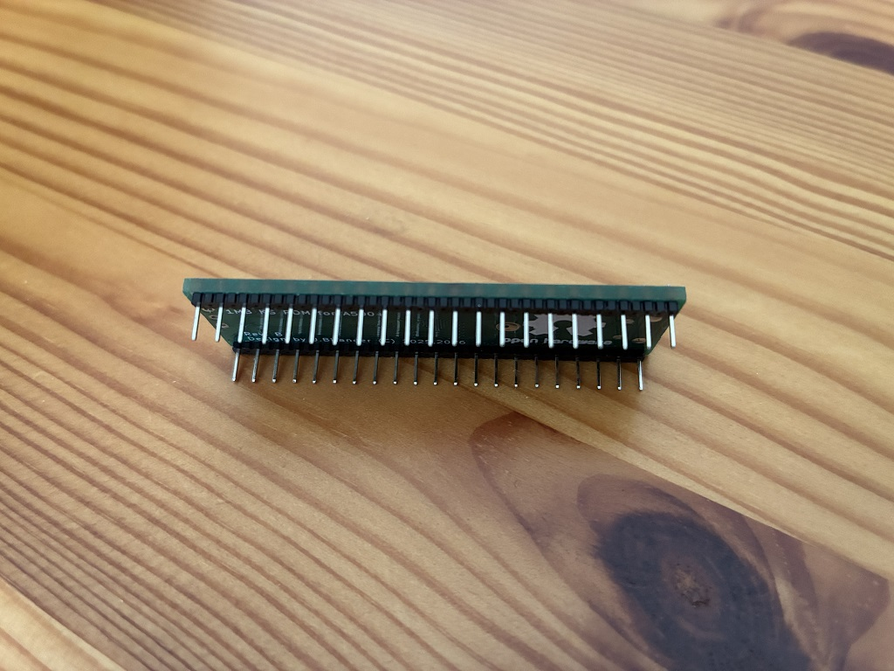</a>

Plastic guards removed and laid next to the board. Also visible: the 3-pin right-angle header fitted to J2 in place of the MSK12D19, with a standard jumper shunt for slot selection:

<a href="images/Meggy_revC_with_plastic_guards_removed.jpg">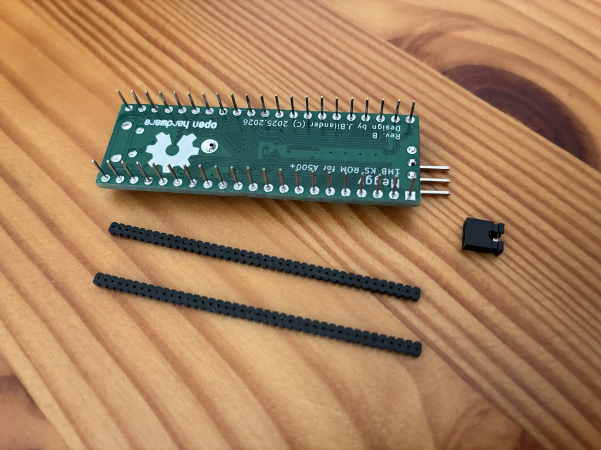</a>

Meggy installed in the A500 rev 6A 40-pin socket. Pin 1 hangs over the left edge of the socket with no connection yet. The can oscillator is visible to the left — this is why the MSK12D19 had to be replaced with a pin header. JP2 carrying the A19 signal is visible on the motherboard just to the left of Meggy's overhanging pin 1:

<a href="images/Meggy_revC_installed_in_A500_pin1_hanging_outside_socket.jpg">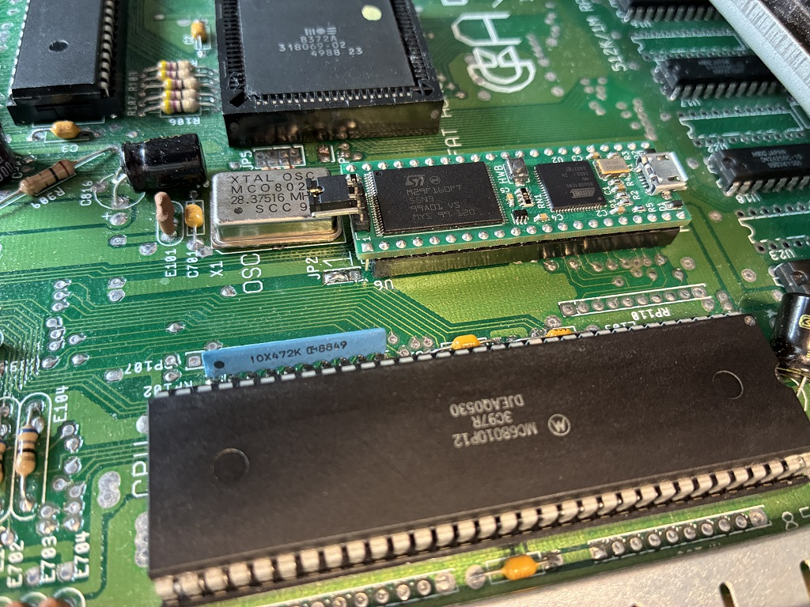</a>

Meggy installed with the A19 jumper wire connected. Yellow test clip leads run from Meggy's overhanging pin 1 to the A19 signal on the 68000 CPU. JP2 on the motherboard — visible just to the left of Meggy — provides a much neater and closer connection point for a permanent wire:

<a href="images/Meggy_revC_installed_in_A500_showing_jumper_wire.jpg">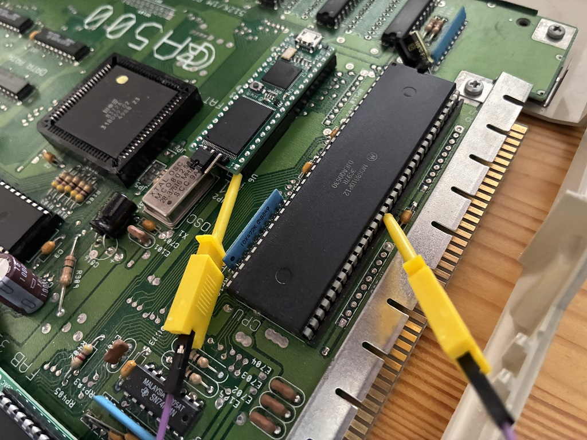</a>

DiagROM V1.2.1 running on the A500 rev 6A — CPU 68000, 1024kB chip RAM confirmed:

<a href="images/Meggy_revC_screenshot_of_diagrom.jpg">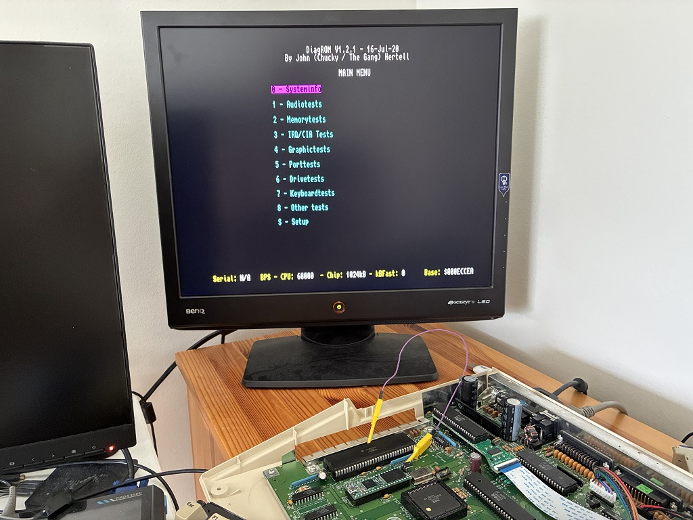</a>

Workbench 1.3 (34.34) booting under Kickstart 3.1.4 (46.143) on the A500 rev 6A. icon.library version 45.22 and workbench.library version 45.194 are both loading from the extended ROM at $E00000 — confirming the full 1MB capitoline image works correctly on the A500 rev 6A:

<a href="images/Meggy_revC_screenshot_of_wb13.jpg">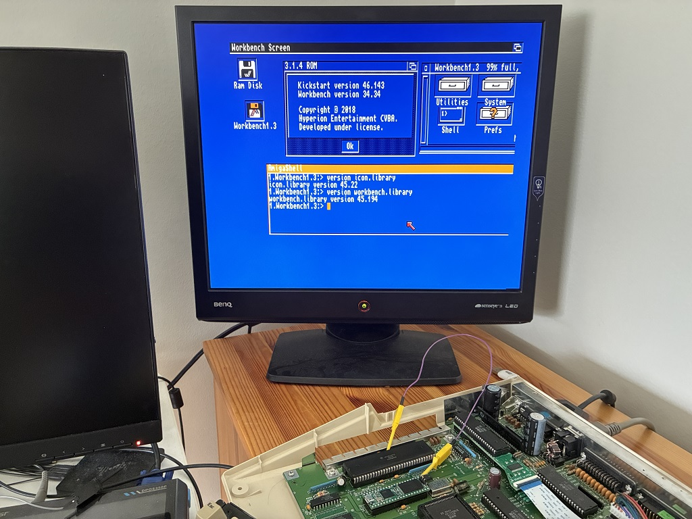</a>

***

# Power Supply Measurements

The diode-OR power circuit was measured with a multimeter to verify correct operation. All measurements taken with Meggy Rev C installed in the Amiga. Click any image for full size.

**USB VBUS and Schottky drop — Amiga off, USB plugged:**

<a href="images/Meggy_revC_voltage_level_from_usb_before_schottky_amiga_off.jpg">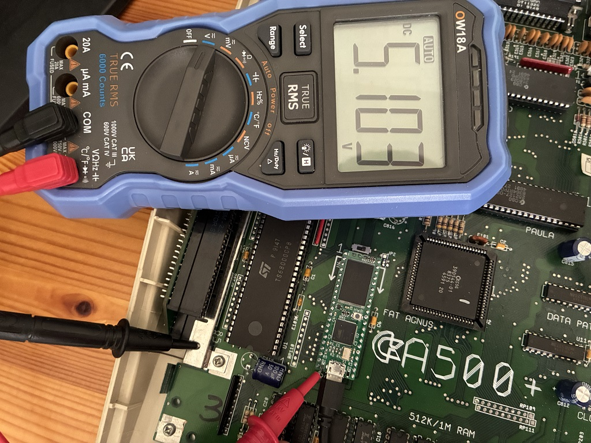</a>
<a href="images/Meggy_revC_voltage_level_from_usb_after_schottky_amiga_off.jpg">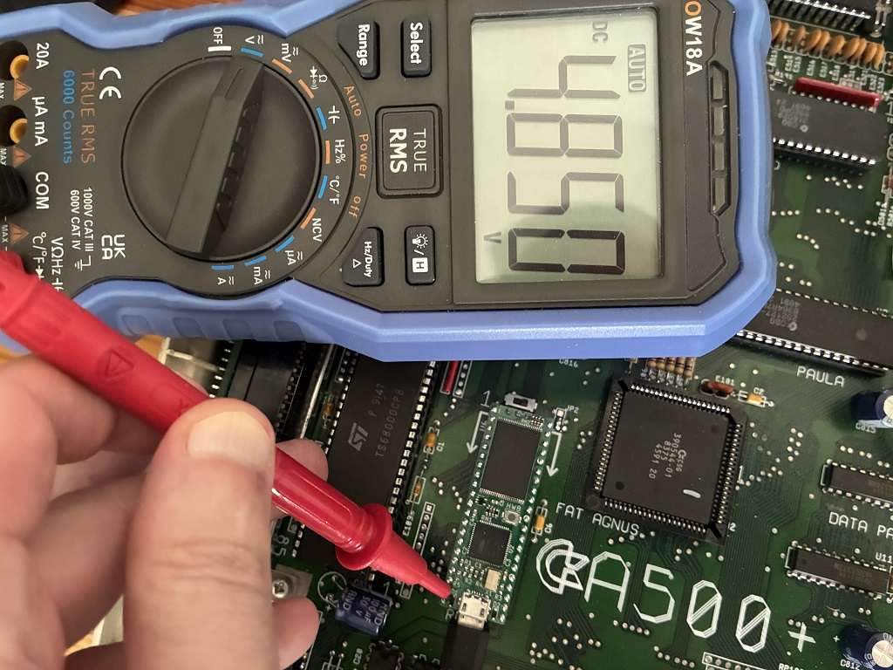</a>
<a href="images/Meggy_revC_voltage_level_at_vcc_amiga_off_usb_plugged.jpg">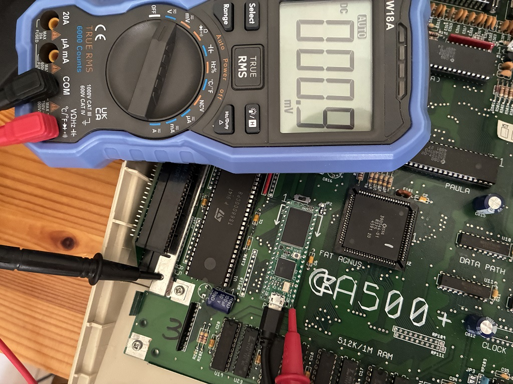</a>

Left to right: **5.103V** raw USB VBUS before D2 — **4.85V** on BOARD_5V after D2 (~250mV Schottky drop) — **0.9mV** on Amiga VCC rail, effectively zero. D1 correctly blocks backfeed from BOARD_5V into the unpowered Amiga.

**Amiga powered on — USB plugged and unplugged:**

<a href="images/Meggy_revC_voltage_level_from_usb_before_schottky_amiga_on_usb_plugged.jpg">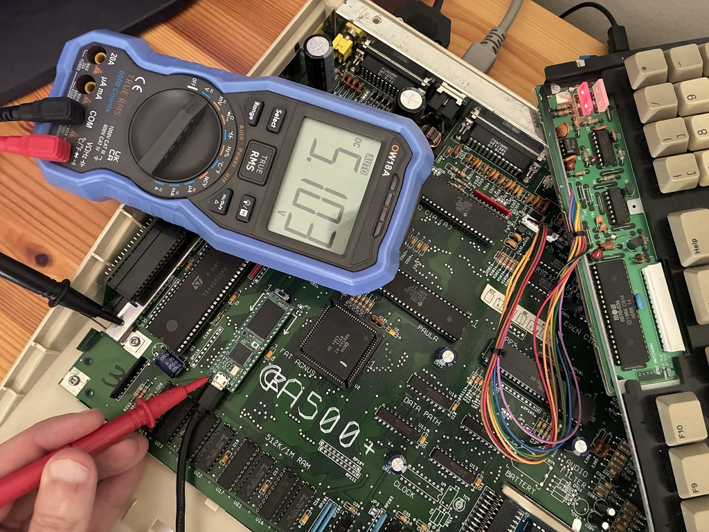</a>
<a href="images/Meggy_revC_voltage_level_at_vcc_amiga_on_usb_plugged.jpg">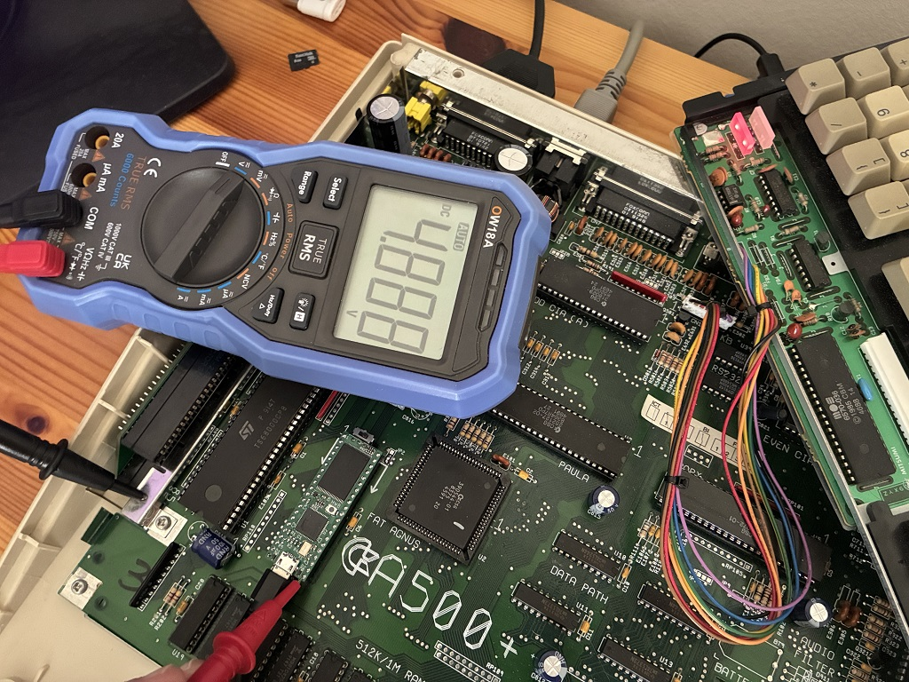</a>
<a href="images/Meggy_revC_voltage_level_at_vcc_amiga_on_usb_unplugged.jpg">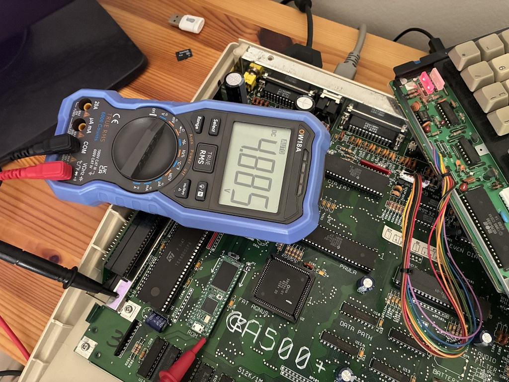</a>

Left to right: **5.103V** VBUS before Schottky with Amiga on and USB plugged — **4.888V** on BOARD_5V with Amiga on and USB plugged — **4.885V** on BOARD_5V with Amiga on and USB unplugged. The diode-OR selects the higher of the two supplies; with only Amiga VCC present the board runs stably at 4.885V.

***

# Image Slot Selection (J2)

J2 controls flash address line A19, selecting which of the two 1MB Kickstart image slots is visible to the Amiga at boot. The switch position also determines which slot is programmed when using `meggy_flash.py`.

| J2 position | Flash A19 | Slot | Typical use |
|-------------|-----------|------|-------------|
| Open | High (10k pull-up) | Slot 1 | Second image |
| Shorted to GND | Low | Slot 0 | Primary / default image |

The switch can be either the MSK12D19 SMD slide switch specified in the BOM (pins bent to right-angle for flush mounting) or a 3-pin 2.54 mm right-angle pin header fitted with an external toggle or jumper.

To change Kickstart without opening the Amiga, route a short cable from J2 to a switch mounted in a convenient location on the machine.
